# cp互动小程序（To Love List）
## 序言
给我家cp写了一个专属的微信小程序，感觉很可爱很满意想让空友都来看！
基于原版（[UxxHans/Rainbow-Cats-Personal-WeChat-MiniProgram](https://github.com/UxxHans/Rainbow-Cats-Personal-WeChat-MiniProgram)）二次开发，可以用于情侣互动、待办事项、监督任务等等。To love list的名字由to do list而来，是希望能够把待办事项和情感互动结合在一起～

其中包含了云开发基础能力的使用：
- **数据库**：对文档型数据库进行读写和管理
- **云函数**：在云端运行的代码，开发者只需编写业务逻辑代码
## 使用逻辑
- 给对方发布任务（今晚早睡）→对方完成任务并获得积分
- 你上架商品（奶茶券）→对方用积分购买→商品进入到对方库存→对方拿着奶茶券让你点奶茶→你点奶茶→ 对方将奶茶券标记为已使用
## 与原作版逻辑的区别：
- 原作版：由你给自己发布任务，对方监督你完成后，对方勾选“完成任务”，增加你的积分
- 二开版：由你给对方发布任务，对方完成后，对方勾选“完成任务”，增加对方的积分；这样做的原因是 给对方发布任务可以增强互动感，例如：女朋友给你布置任务，比起你自己布置的任务，会让你更有去完成的欲望
- 原作者认为监督很重要，所以增加积分的人不能是勾选“完成任务”的人，防止有人没做任务就点击了已完成；但我认为更可以相信大家的自我管理能力一些^ ^

## 效果图
>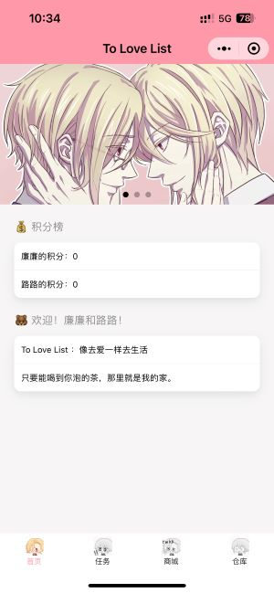
>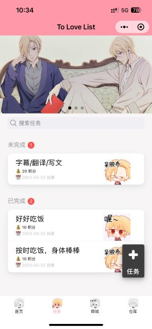
>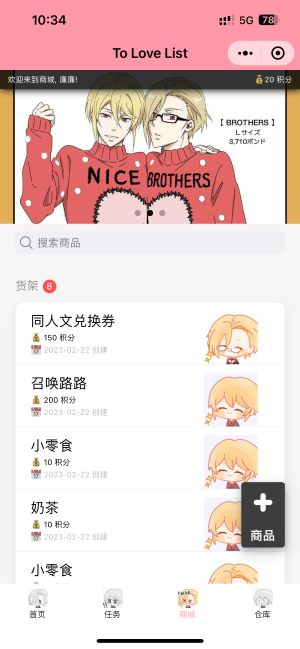
>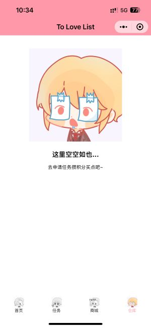
>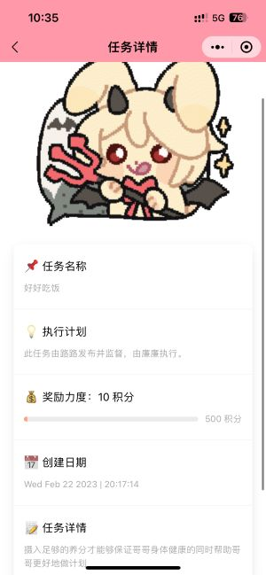
>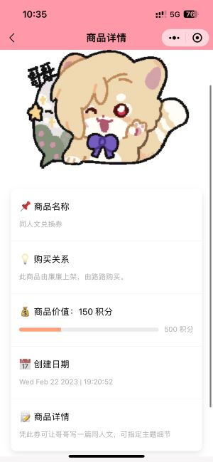
## 部署方式
- 在这里注册小程序开发者: https://mp.weixin.qq.com/cgi-bin/wx
- 在这里登录开发者账号: https://mp.weixin.qq.com/
>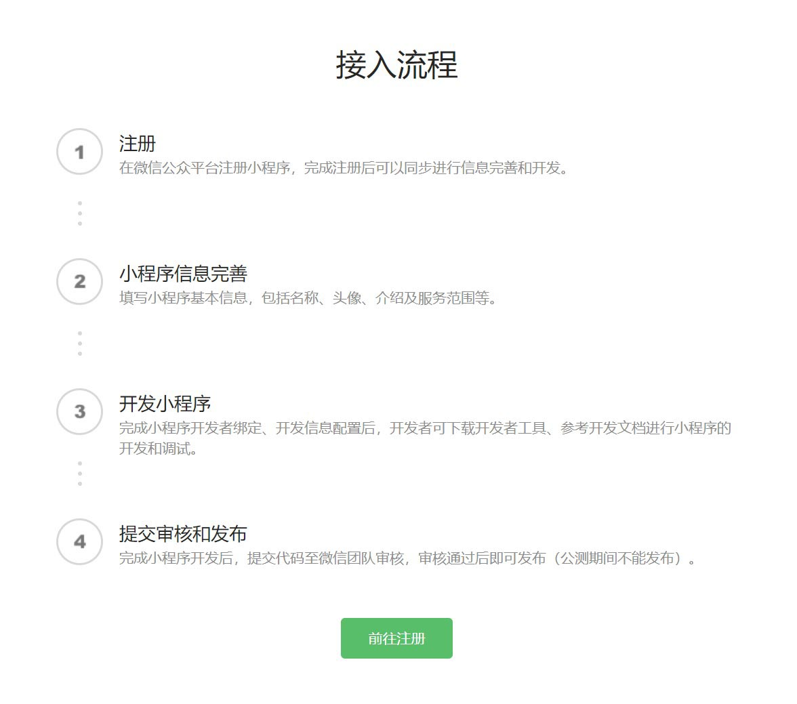
- 登录之后先在`主页`完成小程序`信息`和`类目`
- 然后可以在`管理`中的`版本管理`与`成员管理`中发布小程序体验版并邀请对象使用
>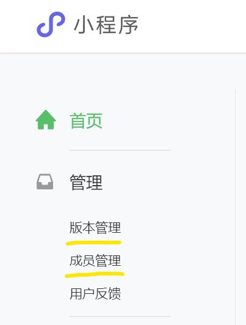
- 随后可以在`开发`中的`开发工具`里下载**微信开发者工具**
- 打开微信开发工具->登录->导入我的文件夹-进入工具
- 在左上角五个选项中选择`云开发`->按照提示开通云开发(这里可以选择免费的，不过限量，我开发用的多，6块够用了)
>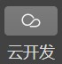
- 进入后点击数据库->在集合名称添加四个集合：`MarketList`, `MissionList`, `StorageList`, `UserList`

>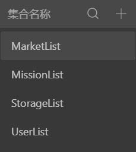
- 在`UserList`中添加两个默认记录, 在两个记录中分别添加两个字段:
```
字段 = _openid | 类型 = string | 值 = 先不填
字段 = credit | 类型 = number | 值 = 0
```
- 打开云开发的控制台的`概览`选项->复制环境ID
- 打开 `miniprogram/envList.js` 将内容全部替换成如下，注意替换环境ID
```js
module.exports = {
  envList: [{
    envId:'上述步骤中你获得的环境ID (保留单引号)'
  }]
}
```
- 右键点击 `cloudfunctions` 中的每个文件夹并选择云函数云端安装依赖上传 (有点麻烦但是这是一定要做的)
>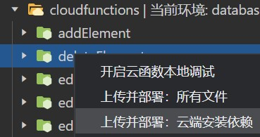
- 如果云开发里面的云函数页面是这样的就是成功了
>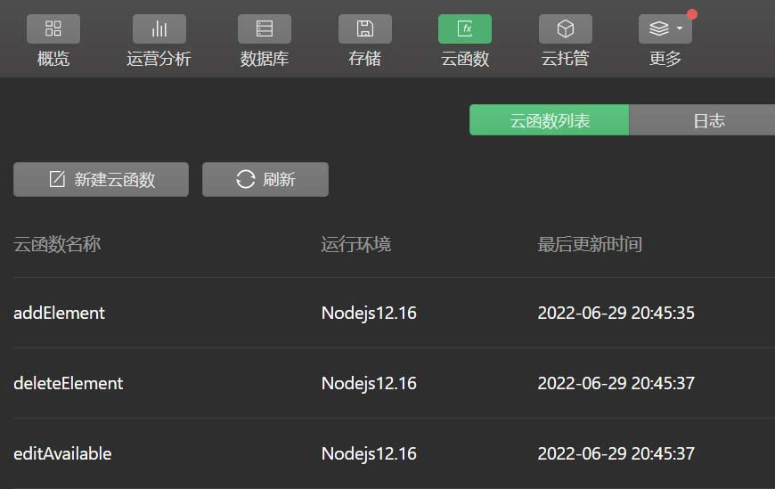
- 没有安装npm或者NodeJs, 需要先在这里安装: https://nodejs.org/dist/v16.15.1/node-v16.15.1-x64.msi
- 安装好的，就直接运行`cloudfunctions/Install-WX-Server-SDK.bat` 
- 不成功的话可以在命令行输入 `npm install --save wx-server-sdk@latest`
- 更改小程序颜色、名字的方法：miniprogram-app.json 第16行是小程序颜色，第17行是小程序名字
- 更改图片的方法：点击各个Images文件夹中的照片，右键“在资源管理器中显示”，将文件夹里面的照片替换掉即可。注意程序大小有限制，图片需要压缩一下，每个图标10k内、图片100k内为佳。
>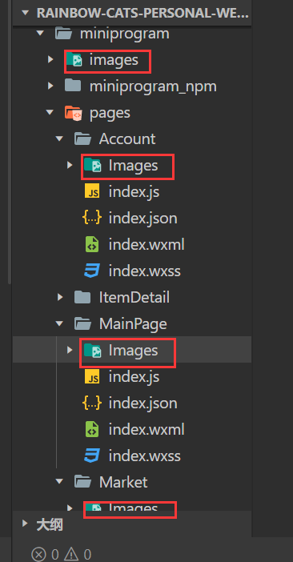
- 首页文字更改方法：Mainpage->index.wxml 代码第27行和第32行
- 然后创建体验版小程序->通过开发者账号分享到女朋友手机上(要先登录小程序开发者账号)
- 在两个手机上运行小程序->分别在两个手机上的小程序里新建任务
- 然后回到云开发控制台的`missionlist`数据库集合->找自己和女朋友的`_openid`变量并记录
- 把这两个记录下来的`_openid`拷贝到云开发控制台`UserList`数据集合里刚刚没填的`_openid`变量中
- 把这两个记录下来的`_openid`拷贝到`miniprogram/app.js`里的`_openidA`和`_openidB`的值里
- 在`miniprogram/app.js`里把`userA`和`userB`改成自己和女朋友的名字
- 然后再试试看是不是成功了! (别忘了任务和物品**左滑**可以完成和购买)
- 别忘了最后点击右上角上传->然后在开发者账号上设置小程序为**体验版**->不用去发布去审核
>
- 最后如果有兴趣可以继续深入开发, 开发文档: https://developers.weixin.qq.com/miniprogram/dev/component/

## 声明
- 二开版小程序内所有图标均来自约稿，未经授权不可使用。
- 若想使用此项目为商用，请先告知原作者（第一作者），谢谢。
